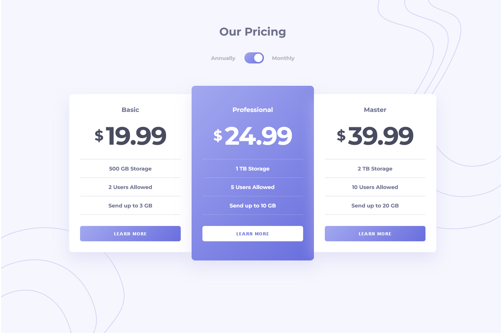

# Frontend Mentor - Pricing component with toggle solution

This is a solution to the [Pricing component with toggle challenge on Frontend Mentor](https://www.frontendmentor.io/challenges/pricing-component-with-toggle-8vPwRMIC). Frontend Mentor challenges help you improve your coding skills by building realistic projects. 

## Table of contents

- [Overview](#overview)
  - [The challenge](#the-challenge)
  - [Screenshot](#screenshot)
  - [Links](#links)
- [Built with](#built-with)
- [Author](#author)

## Overview

### The challenge

Users should be able to:

- View the optimal layout for the component depending on their device's screen size
- Control the toggle with both their mouse/trackpad and their keyboard
- **Bonus**: Complete the challenge with just HTML and CSS

### Screenshot

### Links

- Solution URL: [GitHub](https://github.com/CodeVee/pricing-component-with-toggle)
- Live Site URL: [Netlify](https://incomparable-pony-19d773.netlify.app/)

## Built with

- Semantic HTML5 markup
- SCSS
- Flexbox
- CSS Grid

## Author

- Website - [Victor](https://github.com/CodeVee)
- Frontend Mentor - [@CodeVee](https://www.frontendmentor.io/profile/CodeVee)
- Twitter - [@CodeVee](https://www.twitter.com/CodeVee_)
